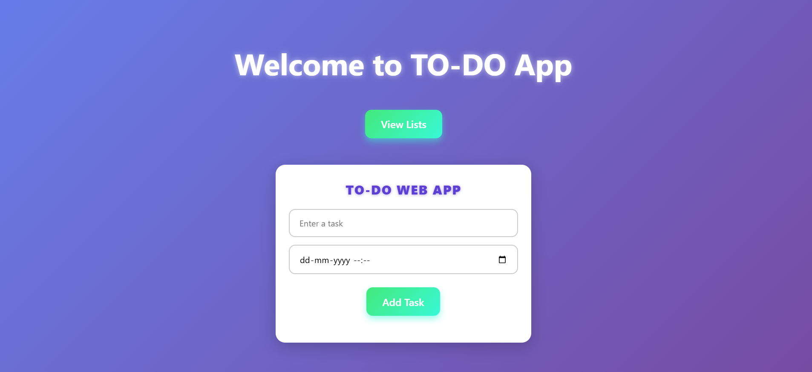
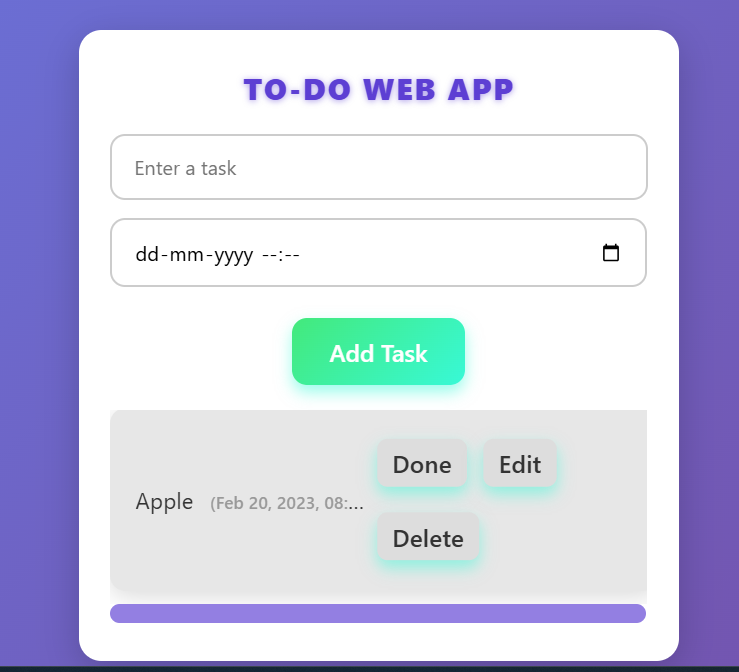

# 📝 Animated Multi-Page To-Do App

A lightweight, fully client-side To-Do application with smooth animated transitions between pages for viewing, adding, editing, and deleting tasks.

## ✨ Features

- ✅ View a list of tasks with completion toggle  
- ➕ Add new tasks with input validation  
- ✏️ Edit existing tasks with inline editing  
- 🗑️ Delete tasks with confirmation prompt  
- 🎞️ Smooth fade and slide animations between pages  
- 📱 Responsive design for desktop and mobile  

## 🚀 How to Use

1. Clone or download this repository.  
2. Open the `TO-DO.html` file in any modern web browser.  
3. Click **Add Task** to create a new to-do item.  
4. Use the **Done**, **Edit**, and **Delete** buttons to manage your tasks.  
5. Confirm deletion or cancel as needed.  
6. All actions update instantly without page reload.  

## 🛠️ Technologies Used

- HTML5  
- CSS3 (Flexbox, transitions, animations)  
- Vanilla JavaScript (ES6)  

## 📄 License

This project is open-source and free to use.

Enjoy managing your tasks with smooth animations! 🎉  

Created By:
**Nireekshith B R**

